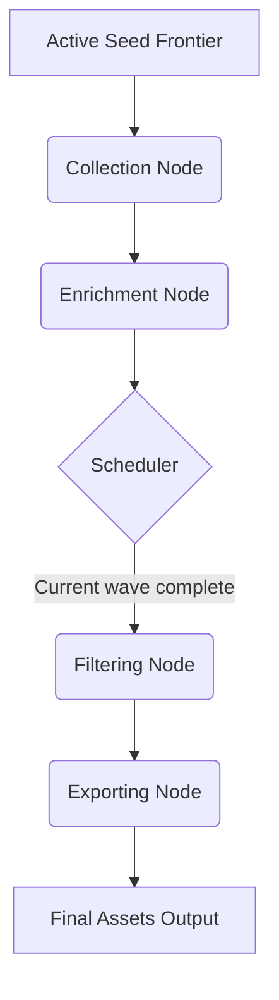

# Architecture

This document describes the architectural decisions for the Asset Discovery project.

## Core Principles

-   **Separation of Concerns**: Each stage of the pipeline (Collection, Enrichment, Filtering, Exporting) is completely isolated. They communicate strictly via data models, not by calling each other's functional logic.
-   **Runtime-Owned Assembly**: `internal/app` is the single place that wires the DAG, shared judges, HTTP clients, outputs, and runtime policy together.
-   **Simplicity first, extensibility second**: The initial implementation uses an in-memory DAG engine for orchestration to allow local E2E testing easily.
-   **Prepared for Event-Driven Design**: The interfaces and contexts are designed so that the in-memory DAG can later be replaced with a PubSub/Message-Queue architecture (e.g., Kafka, NATS, RabbitMQ) for distributed, horizontally scalable microservices.
-   **Split Tracing Concerns**: Runtime observability lives under `internal/tracing/telemetry`, while exported provenance and judge lineage live under `internal/tracing/lineage`.

## Collection Strategies

The pipeline is designed to utilize multiple distinct collector nodes to branch out discovery:
1. **Active DNS Collection**: Nodes that actively resolve DNS records (A, AAAA, MX, TXT) and traverse PTR records or CNAME chains.
2. **Passive OSINT Collection**: Nodes that query public datasets without touching the target's infrastructure, such as Certificate Transparency (CT) logs via `crt.sh`, discovering historical and active Subject Alternative Names (SANs).

## The DAG Pipeline

The stage graph stays acyclic. When an enricher discovers a new domain or PTR target, it does not call collectors directly and it does not control the loop itself. It hands the discovered seed back to the engine scheduler, which may start another collection wave with only that new frontier.



If enrichment discovers new seeds, the scheduler creates a later collection wave that starts again from a new active frontier. That later wave is scheduler behavior, not another edge inside the current DAG.

## Data Models

All nodes interact over a standard set of domain models written in Go.

```go
package models

import "time"

// Seed represents the starting point for discovery.
// A Seed can contain various indicators that help OSINT collectors find assets.
type Seed struct {
    ID          string   `json:"id"`
    CompanyName string   `json:"company_name,omitempty"`
    Domains     []string `json:"domains,omitempty"`      // e.g., ["google.com", "alphabet.com"]
    Address     string   `json:"address,omitempty"`
    Industry    string   `json:"industry,omitempty"`
    
    // Additional Discovery Vectors
    ASN         []int    `json:"asn,omitempty"`          // Autonomous System Numbers owned by the company
    CIDR        []string `json:"cidr,omitempty"`         // Known IP ranges (e.g., 192.168.1.0/24)
    
    // Metadata
    Tags        []string `json:"tags,omitempty"`         // e.g., ["internal", "acquisition", "out-of-scope"]
}

// Enumeration represents a specific discovery run for a Seed.
// A single Seed can have multiple Enumerations over time.
type Enumeration struct {
    ID        string    `json:"id"`
    SeedID    string    `json:"seed_id"`
    Status    string    `json:"status"` // e.g., "pending", "running", "completed", "failed"
    CreatedAt time.Time `json:"created_at"`
    UpdatedAt time.Time `json:"updated_at"`
    StartedAt time.Time `json:"started_at,omitempty"`
    EndedAt   time.Time `json:"ended_at,omitempty"`
}

// DNSRecord represents a resolved DNS record.
type DNSRecord struct {
    Type  string `json:"type"`  // A, AAAA, CNAME, MX, TXT
    Value string `json:"value"` // IP address, target hostname, or text value
}

// AssetType defines the kind of asset discovered.
type AssetType string

const (
    AssetTypeDomain AssetType = "domain"
    AssetTypeIP     AssetType = "ip"
)

// Asset represents any discovered enterprise asset.
// Filtering processes will evaluate records (e.g., checking if CNAMEs point to known SaaS providers)
// to determine true relevance and scope.
type Asset struct {
    ID            string      `json:"id"`
    EnumerationID string      `json:"enumeration_id"` // Links the asset to a specific enumeration run.
    Type          AssetType   `json:"type"`           // e.g., "domain", "ip"
    Identifier    string      `json:"identifier"`     // e.g., "api.google.com" or "192.168.1.100"
    Source        string      `json:"source"`         // Where was this found? (e.g., "dns_collector", "subfinder")
    DiscoveryDate time.Time   `json:"discovery_date"`
    
    // Type-specific details. Only the relevant struct will be populated.
    DomainDetails *DomainDetails `json:"domain_details,omitempty"`
    IPDetails     *IPDetails     `json:"ip_details,omitempty"`
    
    // EnrichmentData contains flexible attributes such as port scan results or HTTP titles.
    EnrichmentData map[string]interface{} `json:"enrichment_data,omitempty"`
}

// DomainDetails holds domain-specific attributes.
type DomainDetails struct {
    Records    []DNSRecord `json:"records,omitempty"`
    IsCatchAll bool        `json:"is_catch_all,omitempty"`
}

// IPDetails holds IP-specific attributes.
type IPDetails struct {
    ASN          int    `json:"asn,omitempty"`
    Organization string `json:"organization,omitempty"`
    PTR          string `json:"ptr,omitempty"`
}

// PipelineContext represents the state passed between DAG nodes.
type PipelineContext struct {
    Seeds        []Seed
    Enumerations []Enumeration
    Assets       []Asset
    Errors       []error
}
```

## Transitioning to PubSub

In the future, the `PipelineContext` will be serialized to JSON or Protobuf and published to message queues (e.g., a "collection_completed" topic), triggering the Enrichment workers independently of the Collection workers. Newly discovered seeds should be emitted as scheduler input for a later collection wave, rather than creating direct node-to-node calls.
