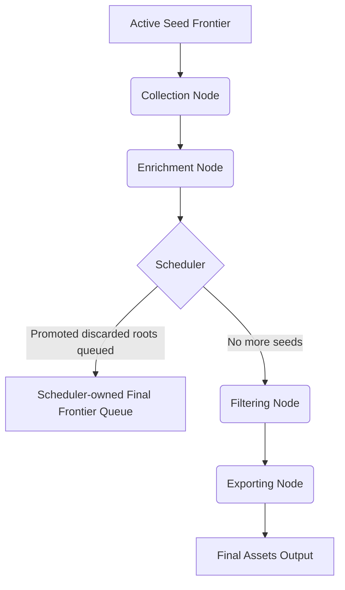

# Architecture

This document describes the architectural decisions for the Asset Discovery project.

## Core Principles

-   **Separation of Concerns**: Each stage of the pipeline (Collection, Enrichment, Filtering, Exporting) is completely isolated. They communicate strictly via data models, not by calling each other's functional logic.
-   **Runtime-Owned Assembly**: `internal/app` is the single place that wires the DAG, shared judges, HTTP clients, outputs, and runtime policy together.
-   **Canonical Runtime Graph**: Runtime processing now uses canonical assets plus raw provenance, instead of one shared slice serving as both raw collector output and final merged export state.
-   **Simplicity first, extensibility second**: The initial implementation uses an in-memory DAG engine for orchestration to allow local E2E testing easily.
-   **Prepared for Event-Driven Design**: The interfaces and contexts are designed so that the in-memory DAG can later be replaced with a PubSub/Message-Queue architecture (e.g., Kafka, NATS, RabbitMQ) for distributed, horizontally scalable microservices.
-   **Split Tracing Concerns**: Runtime observability lives under `internal/tracing/telemetry`, while exported provenance and judge lineage live under `internal/tracing/lineage`.

## Collection Strategies

The pipeline is designed to utilize multiple distinct collector nodes to branch out discovery:
1. **Active DNS Collection**: Nodes that actively resolve DNS records (A, AAAA, MX, TXT) and traverse PTR records or CNAME chains.
2. **Passive OSINT Collection**: Nodes that query public datasets without touching the target's infrastructure, such as Certificate Transparency (CT) logs via `crt.sh`, discovering historical and active Subject Alternative Names (SANs).

## The DAG Pipeline

The stage graph stays acyclic. When an enricher discovers a new domain or PTR target, it does not call collectors directly and it does not control the loop itself. It hands the discovered seed back to the engine scheduler, which may start another collection wave with only that new frontier.



If enrichment discovers new seeds, the scheduler creates a later collection wave that starts again from a new active frontier. That later wave is scheduler behavior, not another edge inside the current DAG.

After the normal frontier is exhausted, the scheduler may run one bounded reconsideration pass over discarded judge candidates using the full run context gathered so far. If that pass promotes any candidates, it creates exactly one final frontier. Seeds discovered during that final frontier are registered for traceability but do not open another follow-up wave.

## Runtime Data Model

The runtime now distinguishes between canonical assets and raw provenance:

```go
package models

import "time"

// Seed represents the starting point for discovery.
// A Seed can contain various indicators that help OSINT collectors find assets.
type Seed struct {
    ID          string   `json:"id"`
    CompanyName string   `json:"company_name,omitempty"`
    Domains     []string `json:"domains,omitempty"`      // e.g., ["google.com", "alphabet.com"]
    Address     string   `json:"address,omitempty"`
    Industry    string   `json:"industry,omitempty"`
    
    // Additional Discovery Vectors
    ASN         []int    `json:"asn,omitempty"`          // Autonomous System Numbers owned by the company
    CIDR        []string `json:"cidr,omitempty"`         // Known IP ranges (e.g., 192.168.1.0/24)
    
    // Metadata
    Tags        []string `json:"tags,omitempty"`         // e.g., ["internal", "acquisition", "out-of-scope"]
}

// Enumeration represents a specific discovery run for a Seed.
// A single Seed can have multiple Enumerations over time.
type Enumeration struct {
    ID        string    `json:"id"`
    SeedID    string    `json:"seed_id"`
    Status    string    `json:"status"` // e.g., "pending", "running", "completed", "failed"
    CreatedAt time.Time `json:"created_at"`
    UpdatedAt time.Time `json:"updated_at"`
    StartedAt time.Time `json:"started_at,omitempty"`
    EndedAt   time.Time `json:"ended_at,omitempty"`
}

// DNSRecord represents a resolved DNS record.
type DNSRecord struct {
    Type  string `json:"type"`  // A, AAAA, CNAME, MX, TXT
    Value string `json:"value"` // IP address, target hostname, or text value
}

// AssetType defines the kind of asset discovered.
type AssetType string

const (
    AssetTypeDomain AssetType = "domain"
    AssetTypeIP     AssetType = "ip"
)

// Asset represents any discovered enterprise asset.
// Filtering processes will evaluate records (e.g., checking if CNAMEs point to known SaaS providers)
// to determine true relevance and scope.
type Asset struct {
    ID              string                     `json:"id"`
    EnumerationID   string                     `json:"enumeration_id"`
    Type            AssetType                  `json:"type"`
    Identifier      string                     `json:"identifier"`
    Source          string                     `json:"source"`
    DiscoveryDate   time.Time                  `json:"discovery_date"`
    Provenance      []AssetProvenance          `json:"provenance,omitempty"`
    OwnershipState  OwnershipState             `json:"ownership_state,omitempty"`
    InclusionReason string                     `json:"inclusion_reason,omitempty"`
    EnrichmentStates map[string]EnrichmentState `json:"enrichment_states,omitempty"`
    DomainDetails *DomainDetails `json:"domain_details,omitempty"`
    IPDetails     *IPDetails     `json:"ip_details,omitempty"`
    EnrichmentData map[string]interface{} `json:"enrichment_data,omitempty"`
}

type AssetObservation struct {
    ID              string                 `json:"id"`
    AssetID         string                 `json:"asset_id,omitempty"`
    EnumerationID   string                 `json:"enumeration_id,omitempty"`
    Type            AssetType              `json:"type"`
    Identifier      string                 `json:"identifier"`
    Source          string                 `json:"source,omitempty"`
    DiscoveryDate   time.Time              `json:"discovery_date,omitempty"`
    OwnershipState  OwnershipState         `json:"ownership_state,omitempty"`
    InclusionReason string                 `json:"inclusion_reason,omitempty"`
    DomainDetails   *DomainDetails         `json:"domain_details,omitempty"`
    IPDetails       *IPDetails             `json:"ip_details,omitempty"`
    EnrichmentData  map[string]interface{} `json:"enrichment_data,omitempty"`
}

type AssetRelation struct {
    ID            string    `json:"id"`
    FromAssetID   string    `json:"from_asset_id,omitempty"`
    FromAssetType AssetType `json:"from_asset_type,omitempty"`
    FromIdentifier string   `json:"from_identifier,omitempty"`
    ToAssetID     string    `json:"to_asset_id,omitempty"`
    ToAssetType   AssetType `json:"to_asset_type,omitempty"`
    ToIdentifier  string    `json:"to_identifier,omitempty"`
    ObservationID string    `json:"observation_id,omitempty"`
    EnumerationID string    `json:"enumeration_id,omitempty"`
    Source        string    `json:"source,omitempty"`
    Kind          string    `json:"kind,omitempty"`
    Label         string    `json:"label,omitempty"`
    Reason        string    `json:"reason,omitempty"`
    DiscoveryDate time.Time `json:"discovery_date,omitempty"`
}

type OwnershipState string

const (
    OwnershipStateOwned                    OwnershipState = "owned"
    OwnershipStateAssociatedInfrastructure OwnershipState = "associated_infrastructure"
    OwnershipStateUncertain                OwnershipState = "uncertain"
)

// PipelineContext represents the state passed between DAG nodes.
type PipelineContext struct {
    Seeds        []Seed
    Enumerations []Enumeration
    Assets       []Asset            // Canonical runtime assets.
    Observations []AssetObservation // Raw per-stage emissions.
    Relations    []AssetRelation    // Discovery and promotion edges.
    Errors       []error
}
```

### Canonical Upsert Rules

- Collectors and enrichers should append observations through the canonical upsert helpers, not append directly to the final runtime asset slice.
- Canonical asset identity is `(type, identifier)`.
- Repeated sightings from later waves or different collectors add provenance, observations, and relations without creating duplicate canonical assets.
- Enrichers operate on canonical assets only.
- Per-stage enrichment state lets runtime code distinguish `missing`, `cached`, `completed`, `failed`, and `retryable` work.

In practice, this means a domain or IP may have many observations and many relations, but only one canonical runtime asset row.

### Ownership And Inclusion

Canonical assets now distinguish why they are present:

- `owned`: corroborated first-party assets
- `associated_infrastructure`: infrastructure observed behind in-scope assets but not yet ownership-verified
- `uncertain`: contradictory or weak ownership signals

The goal is to avoid silently treating all infrastructure behind an accepted domain as first-party ownership.

### Filtering Stage

Primary deduplication now happens during canonical upsert, not in a large end-of-run merge pass. The current merge filter validates the canonical graph and flags issues such as dangling observations, dangling relations, or duplicate canonical keys if they appear.

## Exported Trace Model

The visualizer trace is also structured now. Exported lineage keeps the legacy flat sections for compatibility, but the UI renders from a tree:

```go
type TraceNode struct {
    ID                  string         `json:"id"`
    ParentID            string         `json:"parent_id,omitempty"`
    Kind                string         `json:"kind,omitempty"`
    Label               string         `json:"label"`
    Subtitle            string         `json:"subtitle,omitempty"`
    Badges              []string       `json:"badges,omitempty"`
    LinkedAssetID       string         `json:"linked_asset_id,omitempty"`
    LinkedObservationID string         `json:"linked_observation_id,omitempty"`
    LinkedRelationID    string         `json:"linked_relation_id,omitempty"`
    Details             []TraceSection `json:"details,omitempty"`
}
```

Typical trace node groups are:

- canonical asset
- observations
- seed context
- relations
- enrichment stages

## Transitioning to PubSub

In the future, the canonical asset graph can be serialized to JSON or Protobuf and published to message queues. The important boundary is unchanged: newly discovered seeds should still be emitted as scheduler input for a later collection wave, rather than creating direct node-to-node calls. Raw observations and relations are a better PubSub payload boundary than a single overloaded `Assets` stream because they preserve provenance without forcing workers to replay merge logic differently.
