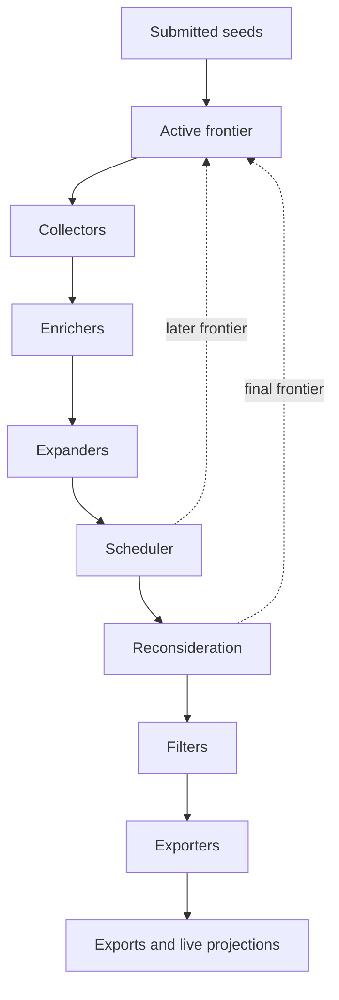

# Architecture

This document describes the stable boundaries of Asset Discovery. It focuses on concepts that should remain true even as collectors, judges, or infrastructure adapters change.

## System Boundaries

- [`internal/app/`](internal/app/): runtime assembly. This package wires the pipeline, shared HTTP clients, judges, exporters, telemetry, run IDs, and output policy.
- [`internal/dag/`](internal/dag/): orchestration. The engine owns run phases, checkpoints, collection waves, and stage execution order.
- [`internal/collect/`](internal/collect/), [`internal/enrich/`](internal/enrich/), [`internal/filter/`](internal/filter/), and [`internal/export/`](internal/export/) contain the concrete stage families already present in the tree. The runtime also supports dedicated expander stages between enrichment and filtering. Stages process runtime state but do not orchestrate other stages.
- [`internal/models/`](internal/models/): pipeline-core runtime state and helper logic. This is where canonical assets, raw observations, relations, scheduler state, and safe snapshot helpers live.
- [`internal/search/`](internal/search/): bounded web-search provider integrations used by expanders.
- [`internal/runservice/`](internal/runservice/): live-run control plane. It owns HTTP APIs, checkpoints, worker leasing, Firestore projections, artifact publication, and resume behavior.
- [`internal/tracing/telemetry/`](internal/tracing/telemetry/) and [`internal/tracing/lineage/`](internal/tracing/lineage/): separate runtime observability from exported provenance and judge lineage.

## Execution Model

The stage graph is acyclic inside a wave. Recurrence happens only because the scheduler may open a later frontier after a wave completes.

Important constraints:

- Collectors never call enrichers directly.
- Enrichers and expanders never recurse into another collection pass themselves.
- Follow-up waves consume only the active frontier, not the full historical seed set.
- Reconsideration can reserve at most one bounded extra frontier after the normal frontier is exhausted.

## Canonical Runtime Graph

The pipeline does not treat one asset slice as both raw stage output and final merged state.

- `Assets` is the canonical runtime graph keyed by `(type, identifier)`.
- `Observations` stores raw per-stage emissions so repeated sightings remain visible.
- `Relations` stores discovery, enrichment, and promotion edges between assets and observations.
- `JudgeEvaluations` records ambiguous ownership or promotion decisions so the live read model can explain them later.

Canonical upsert helpers on `PipelineContext` own merge behavior. Stages should prefer those helpers over direct append patterns so provenance, IDs, ownership state, enrichment state, and relation resolution remain consistent.

For a deeper description of the runtime model, see [docs/runtime-model.md](docs/runtime-model.md).

## Runtime Assembly And Stage Responsibilities

`internal/app` is the only place that should assemble high-level runtime dependencies such as:

- shared HTTP clients
- judges
- exporters
- telemetry providers
- output policy
- run IDs

Concrete stage packages should stay narrowly focused on their own work:

- collectors gather candidates and emit observations or relations
- enrichers mutate canonical assets and add provenance
- expanders evaluate the bounded wave context and propose additional seeds through scheduler-owned helper paths
- filters validate the canonical graph and apply downstream scope policy
- exporters consume a lock-safe snapshot and write final outputs

This separation keeps stage interfaces simple and preserves the option to replace the in-memory engine with a queue-driven runtime later.

## Live Run Architecture

The local CLI and the live run service share the same pipeline assembly, but the live path adds durable control-plane responsibilities.

- [`cmd/server`](cmd/server/main.go) starts the HTTP API, Firebase auth verification, Firestore projections, checkpoint storage, and dispatch.
- [`cmd/worker`](cmd/worker/main.go) processes a single queued run while holding an execution lease.
- [`internal/runservice/Service`](internal/runservice/service.go) creates runs, persists checkpoints, resumes paused work, projects read models, and handles pivot decisions.
- [`internal/runservice/Snapshot`](internal/runservice/types.go) combines the resumable runtime pieces: run metadata, `PipelineContext`, scheduler state, run progress, and pending pivots.

Storage responsibilities are intentionally split:

- Firestore holds the browser-facing read model.
- GCS holds downloadable artifacts.
- Checkpoints live either in the local filesystem or GCS, depending on configuration.

## Operational Modes

### Local CLI

Use the CLI when you want deterministic local runs and file exports without Firebase dependencies.

### In-Process Live Runs

If no worker job configuration is present, the server dispatches live runs back into the same process. This is the simplest local and small-scale deployment mode.

### External Worker Runs

If the worker job environment is configured, the server dispatches runs to a separate worker entrypoint. The worker holds an execution lease, heartbeats it, and avoids duplicate work when another worker already owns the run.

## Queue-Oriented Future

The current runtime uses an in-memory engine because it is easy to reason about locally and easy to validate end to end. The abstraction boundary is still intentionally future-proof:

- stage interfaces remain small
- runtime assembly stays centralized
- scheduling stays outside stage packages
- raw observations and relations form a better event boundary than a single overloaded asset stream

That means a future PubSub or message-broker implementation can change transport and scheduling without changing the core contract: stages emit evidence, the scheduler decides what frontier exists next, and the canonical graph remains explainable.
