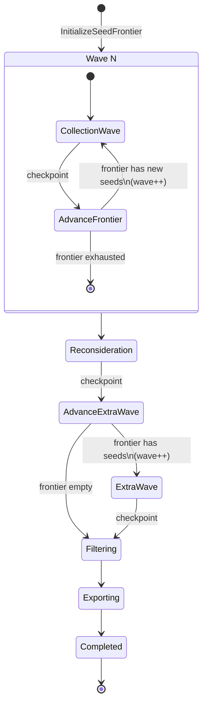
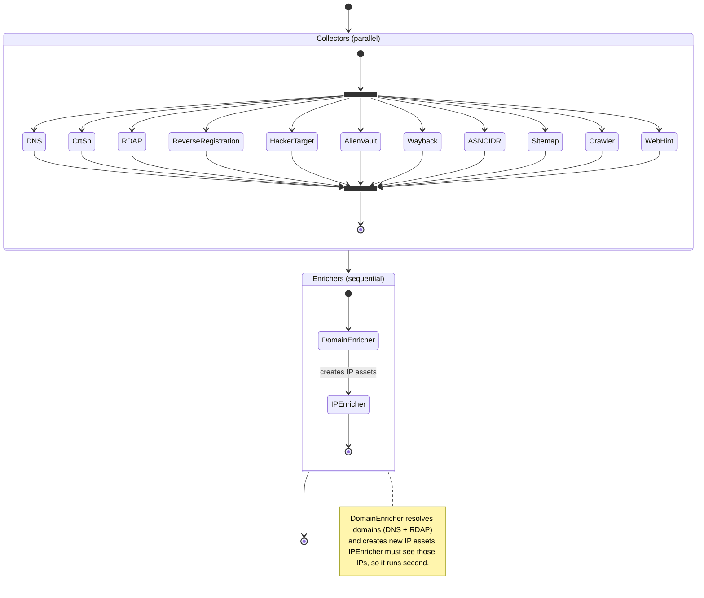
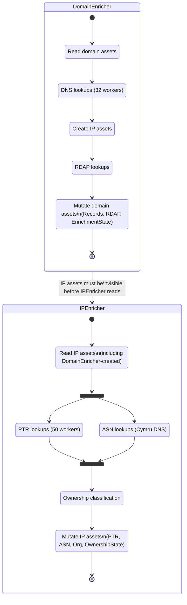
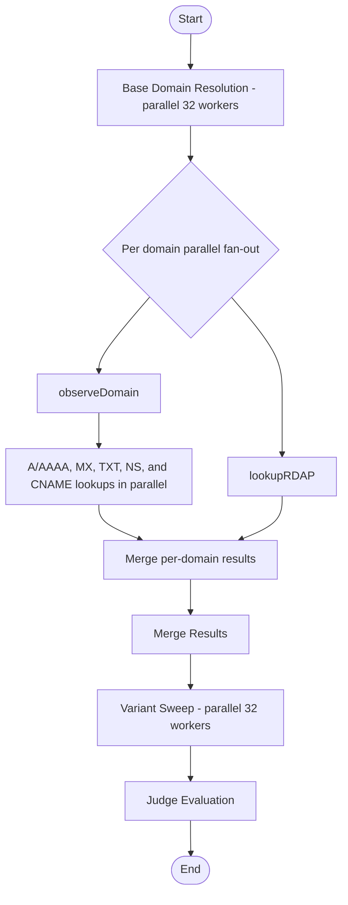

# Pipeline State Machine

## Engine State Machine

The DAG engine (`internal/dag/engine.go`) is a resumable state machine driven by `RunPhase`.
Checkpoints allow the server to pause execution (e.g. for human-in-the-loop pivot review) and resume later.

## What Happens Inside Each Wave (`runWave`)

Each collection wave runs collectors in parallel, then enrichers sequentially.

## Enricher Dependency Detail

## DNS Collector Internal Concurrency (after optimization)

