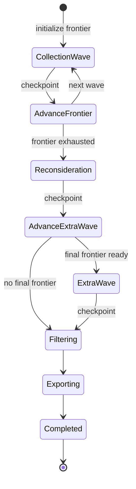
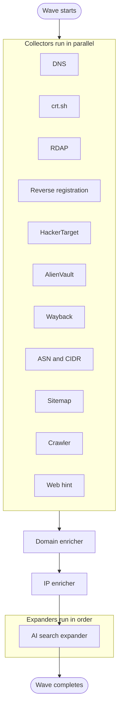
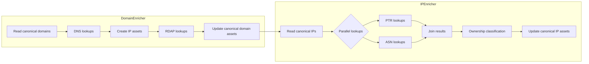
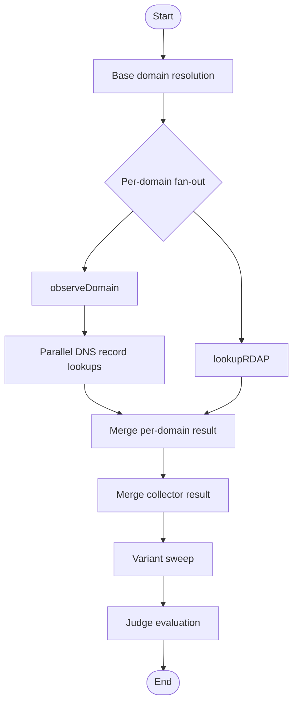

# Pipeline State Machine

The source of truth for execution order is [`internal/dag/engine.go`](../internal/dag/engine.go). These diagrams intentionally use a conservative Mermaid subset so they render reliably in GitHub-flavored Markdown.

## Engine State Machine

The engine is resumable. Checkpoints let the live server pause after major boundaries such as wave completion or reconsideration.

Notes:

- `AdvanceFrontier` increments the wave number before the next collection pass.
- `AdvanceExtraWave` can open at most one bounded extra frontier after reconsideration.
- If the extra frontier is empty, the engine proceeds directly to filtering and export.

## What Happens Inside Each Wave

Collectors run in parallel. Enrichers and expanders then run in order so later stages can see the canonical state created earlier in the wave.

Notes:

- The stage set is assembled in [`internal/app/pipeline.go`](../internal/app/pipeline.go).
- Collector failures are recorded on the runtime context so one collector panic does not automatically abort the whole wave.
- Enrichers and expanders are intentionally ordered, not parallelized together.

## Enricher Dependency Detail

The important dependency is that `IPEnricher` must read canonical IP assets after `DomainEnricher` has had a chance to create them.

Notes:

- `DomainEnricher` mutates canonical domain assets and may create new canonical IP assets in the same wave.
- `IPEnricher` performs PTR and ASN work in parallel internally, then joins those results before mutating canonical IP state.
- The dependency is on canonical visibility, not on direct stage-to-stage calls.

## DNS Collector Internal Concurrency

The DNS collector uses nested concurrency: a base worker pool across domains, plus parallel lookups inside each domain task.

Notes:

- Base domain resolution and variant sweep use the collector worker pool.
- Per-domain DNS record lookups run in parallel for `A`, `AAAA`, `MX`, `TXT`, `NS`, and `CNAME`.
- Judge evaluation happens after the collector has merged the domain-level evidence it gathered.

## Mermaid Authoring Note

GitHub Markdown is the compatibility baseline for diagrams in this repository.

- Do not use raw `\n` inside node labels or edge labels.
- Prefer short labels and move detail into the surrounding prose.
- Use quoted or bracketed labels when punctuation makes Mermaid parsing fragile.
- If a diagram becomes text-heavy, simplify the diagram and explain the nuance below it.
